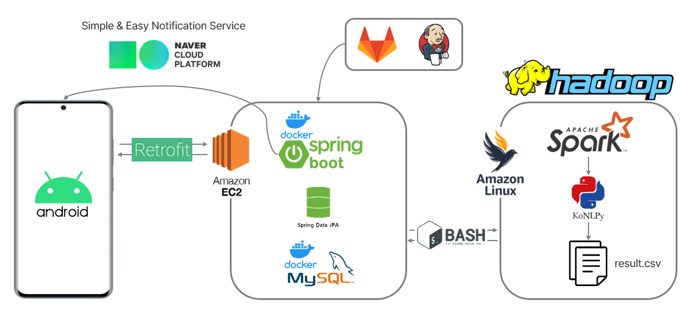

<br>

## 목차
[1. 프로젝트 개요](#1-프로젝트-개요)
- [프로젝트 목표](#1-프로젝트-목표)
- [전체 일정](#2-전체-일정)
- [구성원](#3-구성원)


[2. 프로젝트 설계](#2-프로젝트-설계)
- [Figma](#1-figma)
- [ERD](#2-erd-link)
- [아키텍처](#3-아키텍처)
- [REST API](#4-rest-api-link)

[3. 프로젝트 파일 구조](#3-프로젝트-파일-구조)


[4. 프로젝트 산출물](#4-프로젝트-산출물)
  - [발표자료](#1-발표자료)
  - [UCC](#2-ucc)
  - [포팅 매뉴얼](#3-포팅-매뉴얼)

<br>

## 1. 프로젝트 개요
  ### 1) 프로젝트 목표
    카카오톡 및 카드 결제 SMS를 분석하여 특정 기간의 행적을 분석해 주는 서비스 개발
  ### 2) 전체 일정
  | 기 간 | 내 용 |
  | :---: | :--- |
  | 2022. 08. 22. ~ 2022. 09. 06. | 아이디어 선정 및 사용자 요구사항 분석 |
  | 2022. 09. 07. ~ 2022. 07. 27. | 요구사항 정의서 작성, Mock-up / ERD / REST API 설계 |
  | 2022. 09. 15. ~ 2022. 10. 06. | Android Mobile Application 개발 |
  | 2022. 09. 20. ~ 2022. 10. 01. | SpringBoot REST API Server 개발 및 배포|
  | 2022. 09. 22. ~ 2022. 10. 06. | Data Processing & PySpark Infra 구축 |
  | 2022. 10. 03. ~ 2022. 10. 07. | 유지보수 및 클러스터 복구 |
  ### 3) 구성원
  SSAFY 대전캠퍼스 7th 특화 B103 빅데이터(분산)
  |   Name(Git)   | [강민성](https://github.com/pfcskms1997/) | [김구연](https://github.com/guyontop) | [김대원](https://github.com/Wondae-code) | [이정건](https://github.com/trifoliateorange) | [최수연](https://github.com/sc-choi2022) |
  | :------: | :------: | :------: | :------: | :------: | :------: |
  | Position | :crown: / BackEnd | Mobile | Data | Mobile | Data |

## 2. 프로젝트 설계
   ### 1) Figma [(link)](https://www.figma.com/file/LvrAoMzdEhUhPH0OxJWI1r/MAS?node-id=253%3A139)
   ### 2) ERD [(link)](README-asset/erd.png)
   ### 3) 아키텍처
   
   ### 4) REST API [(link)](README-asset/rest-api-docs.pdf)
     

## 3. 프로젝트 파일 구조
 >  Frontend
```
app
├── manifests
├── java
│    └── com.example.memoryafterservice
│         ├── dto
│         ├── retrofit
│         └── utils
│    
└──  res
      ├── color
      ├── drawable
      ├── layout
      ├── menu
      ├── minimap
      ├── navigation
      ├── values
      └──  xml
```


> Backend
```
└── mas
      ├── config
      ├── controller
      ├── database
      |     ├── entity
      |     └── repository
      ├── request
      ├── response
      ├── service
      └── util
```
## 4. 프로젝트 산출물
  ### 1) [발표자료](exec/발표자료.pptx)
  ### 2) [UCC](http://www.youtube.com)
  ### 3) [포팅 매뉴얼](exec/포팅매뉴얼.pdf)